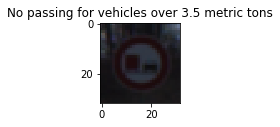

# Self-Driving Car Engineer Nanodegree

## Deep Learning

## Project: Build a Traffic Sign Recognition Classifier


---
## Step 0: Load The Data

The data(training,validation and test) is loaded from the pickle file provided.

---

## Step 1: Dataset Summary & Exploration


#### 1.1. Providing a Basic Summary of the Data Set Using Python, Numpy and/or Pandas

I used the numpy library to calculate summary statistics of the traffic
signs data set:
The number of training examples,testing examples,image data shape and number of classes are listed below.

#### 1.2 Including an exploratory visualization of the dataset

* Here i have created a function to get the Sign name from the classID.


```python
def getSignName(classId):
    '''
    pandas is used to read csv file. It takes input as classId and returns the corresponding sign name.
    '''
    import pandas as pd
    sign_names = pd.read_csv("./signnames.csv",names=["ClassId","SignName"])
    return sign_names["SignName"][classId]


```

##### 1.2.1 Plotting random 6 images from the dataset and displaying the corresponding Sign name with it.





##### 1.2.2 The data distribution(i.e. images per class) is displayed below. 


----

## Step 2: Design and Test a Model Architecture

####  In this step i will describe what preprocessing steps i used and what model i choosed for this project.

##### 2.1 Pre-processing the data

I have applied grayscaling,histogram equlization and normalization in pre-processing.

1) I have used grayscaling because:
* For traffic signs shape is more important than color.
* The model trains faster on single channel grayscale image rather than 3 channel RGB image.

2) I have used histogram eqilization to equlize the brightness level in the images.

3) I used normalization technique to normlize the data in the range of 0.1 to 0.9 using the formula 0.1+((images)*(0.9-0.1))/(255-0) 


The data is pre-processed(grayscaling,histogram equlization and normalization) at this step.


### Model Architecture

I have used the LeNet model and modified it by changing the shape in the last fully connected layer and added dropout after 
first two fully connected layers to meet the project requirement.

My final model consisted of the following layers:

| Layer         		|     Description	        					| 
|:---------------------:|:---------------------------------------------:| 
| Input         		| 32x32x1 Grayscale image   					| 
| Convolution 5x5     	| 1x1 stride, valid padding, outputs 28x28x6 	|
| RELU					|												|
| Max pooling	      	| 2x2 stride,  outputs 14x14x6  				|
| Convolution 5x5	    | 1x1 stride, valid padding, outputs 10x10x16	|
| RELU					|												|
| Max pooling	      	| 2x2 stride,  outputs 5x5x16   				|
| Flatten    	      	| Output 400                                    |
| Fully connected		| Output 120   									|
| RELU					|												|
| Droput				| Keep_prob : 0.65								|
| Fully connected		| Output 84   									|
| RELU					|												|
| Droput				| Keep_prob : 0.65								|
| Fully connected		| Output 43   									|


### Train, Validate and Test the Model

###  How i trained the model

The training data is shuffled before passing to the model. A learning rate of 0.001 is used with 70 EPOCHS and a batch size of 128.

I have used an AdamOptimizer because A learning rate is maintained for each network weight (parameter) and separately adapted as learning unfolds as opposed to Stochastic gradient descent which maintains a single learning rate (termed alpha) for all weight updates and the learning rate does not change during training. [Source](https://machinelearningmastery.com/adam-optimization-algorithm-for-deep-learning/)


A plot of Accuracy(y-axis) vs Epochs(x-axis) is shown above. The red dotted line shows training accuracy 
and blue dotted line shows validation accuracy

    

####  Describing the approach taken for finding a solution and getting the validation set accuracy to be at least 0.93.

My final model results were:
* training set accuracy of 1.000
* validation set accuracy of 0.954
* test set accuracy of 0.938

* First i tried with the orignal lenet architecture without any augmentation or histogram equilization.
    It was giving me around 92-93% accuracy.
* Then i used histogram equilization which improved my model.
* At this point i was getting good training accuracy but the validation accuracy and test accuracy was not so good, probably my model was overfitting so i used a dropout of 35%(keep_prob:0.65) after the first two fully connected layers and after that i got the validation accuracy more than 95% and a test accuracy of 93.8%.

---

## Step 3: Test a Model on New Images

    

### Load and Output the Images

I have downloaded 10 images from the internet which are plotted below.


Pre-processing is done on the newly downloaded images.


```python

new_images = convert_to_gray(new_images)
new_images = equilize_histogram(new_images)
new_images = normalize(new_images)


```

### Predict the Sign Type for Each Image


### Analyze Performance


The model predicted 9 out of 10 new images from the web correctly.

* The model predicted the 5th image of class 3(i.e 60 km/hr image) wrongly as image of class 1(i.e 30 km/hr) because the number of images in class 3 are less as compared to images in class 1, so the model is not trained properly on images of class 3(i.e 30 km/hr images).
